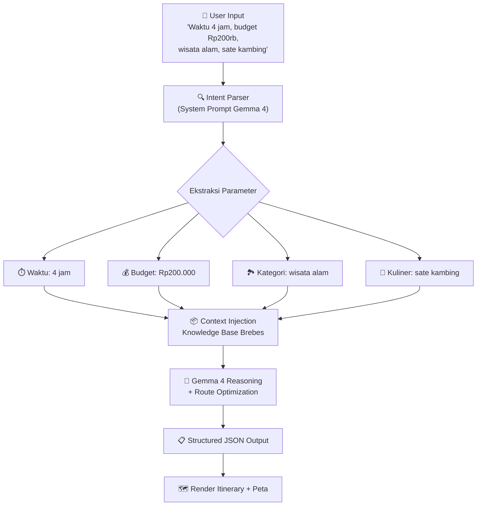
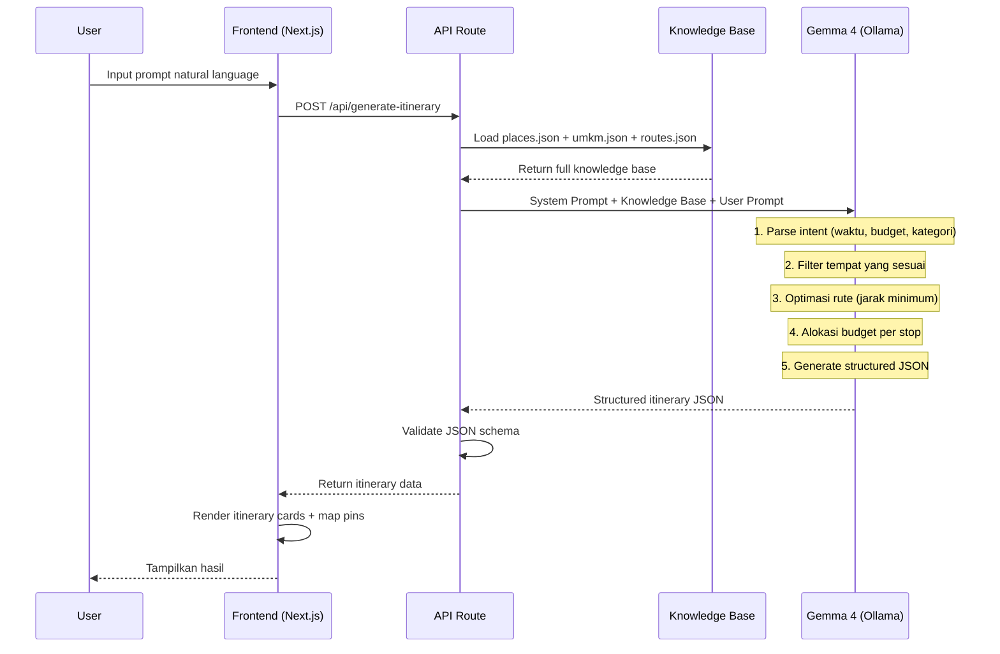
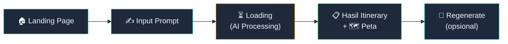

# 🗺️ itinerary.ai — Rancangan Arsitektur MVP & Alur UI/UX

> **Misi:** Meningkatkan visibilitas wisata & UMKM lokal Brebes melalui rekomendasi perjalanan yang dipersonalisasi oleh AI.

---

## 1. Desain Sistem & Logika AI

### Arsitektur Sistem Keseluruhan


### Tech Stack MVP

| Layer | Teknologi | Alasan Pemilihan |
|:------|:----------|:-----------------|
| **Frontend** | Next.js 14 (App Router) | SSR, API routes built-in, React ecosystem |
| **Peta** | Leaflet.js + OpenStreetMap | Gratis, open-source, tidak perlu API key |
| **AI Engine** | Gemma 4 12B via Ollama | Open-weight, 256K context, function calling native, bisa jalan lokal |
| **Data Store** | JSON files (knowledge base) | Cukup untuk MVP, mudah di-maintain |
| **Styling** | Vanilla CSS + CSS Variables | Kontrol penuh, performa optimal |

### Alur Logika AI (Gemma 4 sebagai Inti)



### Strategi Penstrukturan Data Lokal

Gemma 4 memproses data melalui **Context Injection** — seluruh knowledge base Brebes di-inject ke system prompt sebagai konteks. Berikut struktur datanya:

#### `data/places.json` — Database Wisata
```json
{
  "places": [
    {
      "id": "place_001",
      "name": "Kebun Teh Kaligua",
      "category": ["wisata_alam", "agrowisata"],
      "description": "Perkebunan teh seluas 254 ha di lereng Gunung Slamet dengan udara sejuk dan pemandangan hijau.",
      "location": { "lat": -7.2456, "lng": 109.0523 },
      "address": "Desa Pandansari, Kec. Paguyangan, Brebes",
      "estimated_cost": 15000,
      "estimated_duration_minutes": 90,
      "operating_hours": "07:00-17:00",
      "rating": 4.5,
      "tags": ["outdoor", "fotografi", "keluarga", "sejuk"],
      "image_url": "/images/kaligua.jpg"
    },
    {
      "id": "place_002",
      "name": "Waduk Malahayu",
      "category": ["wisata_alam", "wisata_air"],
      "description": "Waduk dengan pemandangan perbukitan dan area pemancingan. Cocok untuk piknik keluarga.",
      "location": { "lat": -7.1234, "lng": 108.9876 },
      "address": "Desa Malahayu, Kec. Banjarharjo, Brebes",
      "estimated_cost": 10000,
      "estimated_duration_minutes": 60,
      "operating_hours": "06:00-18:00",
      "rating": 4.2,
      "tags": ["outdoor", "pemancingan", "keluarga"],
      "image_url": "/images/malahayu.jpg"
    }
  ]
}
```

#### `data/umkm.json` — Database UMKM & Kuliner
```json
{
  "umkm": [
    {
      "id": "umkm_001",
      "name": "Sate Kambing Pak Karto",
      "category": ["kuliner", "sate_kambing"],
      "description": "Warung sate kambing legendaris sejak 1985. Bumbu kacang khas Brebes dengan daging empuk.",
      "location": { "lat": -6.8723, "lng": 109.0412 },
      "address": "Jl. Veteran No. 23, Brebes Kota",
      "price_range": { "min": 25000, "max": 50000 },
      "avg_price_per_person": 35000,
      "estimated_duration_minutes": 45,
      "operating_hours": "10:00-21:00",
      "rating": 4.7,
      "tags": ["sate_kambing", "halal", "legendaris"],
      "menu_highlights": ["Sate Kambing", "Tongseng", "Gulai"],
      "image_url": "/images/sate-karto.jpg"
    },
    {
      "id": "umkm_002",
      "name": "Telur Asin Bu Hj. Sumirah",
      "category": ["oleh_oleh", "telur_asin"],
      "description": "Produsen telur asin khas Brebes dengan varian asap dan original sejak 1978.",
      "location": { "lat": -6.8690, "lng": 109.0389 },
      "address": "Jl. Diponegoro No. 55, Brebes Kota",
      "price_range": { "min": 3000, "max": 6000 },
      "avg_price_per_person": 20000,
      "estimated_duration_minutes": 20,
      "operating_hours": "08:00-20:00",
      "rating": 4.8,
      "tags": ["oleh_oleh", "telur_asin", "ikon_brebes"],
      "image_url": "/images/telur-asin.jpg"
    }
  ]
}
```

#### `data/routes.json` — Estimasi Jarak & Waktu Antar Lokasi
```json
{
  "routes": [
    {
      "from": "place_001",
      "to": "umkm_001",
      "distance_km": 12.5,
      "estimated_travel_minutes": 25,
      "transport_mode": "motor/mobil"
    }
  ]
}
```

### System Prompt Engineering untuk Gemma 4

```
SYSTEM PROMPT:
Kamu adalah "itinerary.ai", asisten perjalanan AI untuk Kabupaten Brebes, 
Jawa Tengah. Tugasmu adalah membuat rencana perjalanan (itinerary) yang 
dipersonalisasi berdasarkan input pengguna.

ATURAN KETAT:
1. HANYA gunakan data dari knowledge base yang diberikan. 
   JANGAN mengarang tempat/UMKM yang tidak ada di database.
2. Total estimasi biaya HARUS ≤ budget pengguna.
3. Total waktu (durasi di tempat + perjalanan) HARUS ≤ waktu yang tersedia.
4. Prioritaskan tempat dengan rating tertinggi yang sesuai preferensi.
5. Optimalkan rute agar jarak tempuh antar lokasi minimal.
6. Selalu sertakan minimal 1 destinasi UMKM/kuliner lokal.

OUTPUT FORMAT (JSON KETAT):
{
  "itinerary": {
    "title": "string — judul menarik untuk itinerary",
    "total_duration_minutes": number,
    "total_estimated_cost": number,
    "stops": [
      {
        "order": number,
        "place_id": "string",
        "name": "string",
        "category": "string",
        "arrival_time": "HH:MM",
        "duration_minutes": number,
        "estimated_cost": number,
        "description": "string — deskripsi singkat mengapa dikunjungi",
        "tips": "string — tips praktis untuk pengunjung",
        "location": { "lat": number, "lng": number }
      }
    ],
    "travel_segments": [
      {
        "from_order": number,
        "to_order": number,
        "distance_km": number,
        "travel_minutes": number,
        "transport": "string"
      }
    ],
    "budget_breakdown": {
      "tiket_wisata": number,
      "kuliner": number,
      "transportasi": number,
      "total": number,
      "sisa_budget": number
    },
    "ai_notes": "string — catatan tambahan dari AI"
  }
}

KNOWLEDGE BASE:
[Di sini akan di-inject isi places.json + umkm.json + routes.json]
```

### Mekanisme Pemrosesan AI (Step-by-Step)



> [!IMPORTANT]
> **Mengapa Context Injection, bukan RAG?** Untuk MVP, total data Brebes diperkirakan < 50 lokasi. Dengan context window Gemma 4 12B sebesar **256K tokens**, seluruh knowledge base bisa di-inject langsung ke prompt (~5K-10K tokens). Ini menghilangkan kompleksitas vector database dan retrieval pipeline, sehingga development lebih cepat dan demo lebih reliable.

---

## 2. Desain Antarmuka (Itinerary + Peta)

### Konsep Visual — Split-Screen Layout


### Wireframe Detail per Komponen

#### 📐 Layout Utama (Split-Screen)

```
┌──────────────────────────────────────────────────────────────────┐
│  ✨ itinerary.ai                          [Tentang] [Brebes 📍] │  ← Navbar
├────────────────────────┬─────────────────────────────────────────┤
│                        │                                         │
│  🔍 Prompt Input Bar   │                                         │
│  ┌──────────────────┐  │                                         │
│  │ "Waktu 4 jam,    │  │         🗺️ INTERACTIVE MAP              │
│  │  budget Rp200rb, │  │         (Leaflet + OpenStreetMap)       │
│  │  wisata alam..." │  │                                         │
│  └──────────────────┘  │         📍 Pin 1 (merah)               │
│                        │              ╌╌╌╌╌╌                     │
│  ── ITINERARY CARDS ── │         📍 Pin 2 (hijau)               │
│                        │              ╌╌╌╌╌╌                     │
│  ●─ Stop 1             │         📍 Pin 3 (biru)                │
│  │  Kebun Teh Kaligua  │                                         │
│  │  ⏱️ 90 min │ 💰 15K │         [Dotted route line between     │
│  │                     │          all pins]                      │
│  ●─ Stop 2             │                                         │
│  │  Sate Kambing       │                                         │
│  │  ⏱️ 45 min │ 💰 35K │                                         │
│  │                     │                                         │
│  ●─ Stop 3             │         ┌─────────────────────┐         │
│  │  Telur Asin         │         │ Budget Breakdown    │         │
│  │  ⏱️ 20 min │ 💰 20K │         │ 🎫 Rp15.000        │         │
│  │                     │         │ 🍖 Rp55.000        │         │
│     ── SUMMARY ──      │         │ 🚗 Rp30.000        │         │
│  Total: Rp120.000      │         │ Total: Rp120.000   │         │
│  Sisa: Rp80.000 ✅     │         │ Sisa: Rp80.000 ✅  │         │
│  Durasi: 3j 45m        │         └─────────────────────┘         │
│                        │                                         │
│  [🔄 Regenerate]       │                                         │
│  [📤 Share Itinerary]  │                                         │
└────────────────────────┴─────────────────────────────────────────┘
         40% width                        60% width
```

#### 🎨 Design System

| Token | Nilai | Penggunaan |
|:------|:------|:-----------|
| `--bg-primary` | `#0f172a` (Slate 900) | Background utama |
| `--bg-card` | `rgba(30, 41, 59, 0.8)` | Card glassmorphism |
| `--accent` | `#14b8a6` (Teal 500) | Aksen utama, timeline dots |
| `--accent-glow` | `#2dd4bf` (Teal 400) | Hover states, glow effects |
| `--text-primary` | `#f1f5f9` (Slate 100) | Teks utama |
| `--text-secondary` | `#94a3b8` (Slate 400) | Teks sekunder |
| `--success` | `#22c55e` | Budget aman |
| `--warning` | `#f59e0b` | Budget mendekati limit |
| `--danger` | `#ef4444` | Budget terlampaui |
| `--font` | `'Inter', sans-serif` | Tipografi utama |
| `--radius` | `12px` | Border radius card |
| `--blur` | `backdrop-filter: blur(16px)` | Glassmorphism |

#### 🧩 Komponen UI Utama

**1. Prompt Input Bar**
- Textarea dengan placeholder: *"Ceritakan rencana wisatamu... (contoh: 4 jam, Rp200rb, wisata alam)"*
- Tombol submit dengan ikon ✨ dan loading animation (sparkle pulse)
- Quick-suggestion chips di bawah: `Wisata Alam` `Kuliner` `Keluarga` `< Rp100K`

**2. Itinerary Card**
- Glassmorphism card dengan `backdrop-filter: blur(16px)`
- Timeline vertical line (teal gradient) menghubungkan setiap card
- Ikon kategori otomatis: 🏞️ wisata alam, 🍖 kuliner, 🛍️ oleh-oleh
- Hover: card terangkat + glow border + pin peta berkedip

**3. Interactive Map (Leaflet)**
- Custom dark-theme tile: CartoDB Dark Matter
- Numbered pin markers (warna sesuai kategori)
- Dotted polyline route antar pin
- Popup on click: nama tempat + foto + biaya
- Auto-fit bounds ke seluruh pin saat itinerary dimuat

**4. Budget Summary Bar**
- Progress bar visual (terisi proporsional)
- Warna dinamis: hijau (< 70%), kuning (70-90%), merah (> 90%)
- Breakdown per kategori dengan ikon

#### 📱 Responsivitas (Mobile)
- Di bawah `768px`: layout beralih ke **stacked** (itinerary di atas, peta di bawah)
- Peta menjadi collapsible dengan tombol "Lihat Peta 🗺️"
- Prompt bar tetap sticky di atas

---

## 3. Skenario Demo MVP — Alur Pengguna End-to-End

### Alur Utama (Happy Path)



### Script Demo (Step-by-Step)

---

#### 📍 Step 1: Landing Page (2 detik)

**Apa yang user lihat:**
- Hero section dengan headline: *"Jelajahi Brebes dengan AI sebagai pemandu wisatamu"*
- Sub-headline: *"Cukup ceritakan waktu, budget, dan keinginanmu — itinerary.ai akan merancang perjalanan terbaik untukmu."*
- Satu prompt input bar yang besar dan prominent di tengah layar
- Quick-suggestion chips: `🏞️ Wisata Alam` `🍖 Sate Blengong` `🫖 Teh Kaligua` `👨‍👩‍👧 Keluarga`
- Background: subtle animated gradient (teal → slate)

**User action:** Klik pada prompt input bar.

---

#### ✍️ Step 2: Input Prompt (5 detik)

**User mengetik:**
> *"Waktu 4 jam, budget Rp200 ribu, wisata alam, sate kambing"*

**Micro-interactions:**
- Typing indicator di prompt bar
- Suggestion chips yang relevan di-highlight otomatis
- Tombol "✨ Buatkan Itinerary" muncul saat user mulai mengetik

**User action:** Klik tombol "✨ Buatkan Itinerary"

---

#### ⏳ Step 3: AI Processing (3-8 detik)

**Apa yang user lihat:**
- Skeleton loading cards muncul di panel kiri (3 placeholder cards)
- Peta di kanan menampilkan area Brebes dengan subtle zoom-in animation
- Teks loading: *"✨ itinerary.ai sedang merancang perjalananmu..."*
- Progress dots animation: ●●○ → ●●● 

**Di balik layar:**
1. Frontend mengirim POST ke `/api/generate-itinerary`
2. API route me-load knowledge base dari JSON files
3. System prompt + knowledge base + user prompt dikirim ke Gemma 4 via Ollama
4. Gemma 4 memproses dan mengembalikan structured JSON
5. API memvalidasi schema dan mengirim response

---

#### 📋 Step 4: Hasil Ditampilkan (Momen "Wow")

**Panel Kiri — Itinerary Cards (stagger animation, muncul satu per satu):**

```
┌─────────────────────────────────────┐
│ ✨ "Petualangan Alam & Rasa Brebes" │  ← AI-generated title
│   ⏱️ 3 jam 45 menit │ 💰 Rp120.000 │
├─────────────────────────────────────┤
│                                     │
│ 🟢 Stop 1 — 08:00                   │
│ ┌─────────────────────────────────┐ │
│ │ 🏞️ Kebun Teh Kaligua            │ │
│ │ Nikmati udara sejuk di lereng   │ │
│ │ Gunung Slamet dan foto di       │ │
│ │ hamparan kebun teh.             │ │
│ │ ⏱️ 90 min │ 💰 Rp15.000         │ │
│ │ 💡 Tips: Datang pagi untuk      │ │
│ │    kabut terbaik!               │ │
│ └─────────────────────────────────┘ │
│ │ 🚗 25 min (12.5 km)              │
│                                     │
│ 🟡 Stop 2 — 10:05                   │
│ ┌─────────────────────────────────┐ │
│ │ 🍖 Sate Kambing Pak Karto       │ │
│ │ Warung legendaris sejak 1985.   │ │
│ │ Bumbu kacang khas + daging      │ │
│ │ empuk yang wajib dicoba!        │ │
│ │ ⏱️ 45 min │ 💰 Rp35.000         │ │
│ │ 💡 Tips: Pesan tongseng juga!   │ │
│ └─────────────────────────────────┘ │
│ │ 🚗 10 min (5.2 km)               │
│                                     │
│ 🔵 Stop 3 — 11:00                   │
│ ┌─────────────────────────────────┐ │
│ │ 🛍️ Telur Asin Bu Hj. Sumirah   │ │
│ │ Bawa pulang oleh-oleh ikon      │ │
│ │ Brebes — telur asin varian      │ │
│ │ asap yang legendaris.           │ │
│ │ ⏱️ 20 min │ 💰 Rp20.000         │ │
│ │ 💡 Tips: Coba varian udang!     │ │
│ └─────────────────────────────────┘ │
│                                     │
│ ── 💰 RINGKASAN BUDGET ──           │
│ 🎫 Tiket:      Rp 15.000           │
│ 🍖 Kuliner:    Rp 55.000           │
│ 🚗 Transport:  Rp 30.000           │
│ 🛍️ Oleh-oleh:  Rp 20.000           │
│ ───────────────────────             │
│ Total:         Rp120.000            │
│ Sisa Budget:   Rp 80.000 ✅         │
│ ████████████░░░░░░░ 60%             │
│                                     │
│ [🔄 Coba Lagi] [📤 Bagikan]         │
└─────────────────────────────────────┘
```

**Panel Kanan — Peta Interaktif:**
- 3 pin marker muncul dengan bounce animation
- Pin 1 (🟢 hijau): Kebun Teh Kaligua
- Pin 2 (🟡 kuning): Sate Kambing Pak Karto
- Pin 3 (🔵 biru): Telur Asin Bu Hj. Sumirah
- Garis putus-putus (dotted polyline) menghubungkan pin sesuai urutan
- Peta auto-zoom untuk menampilkan semua pin
- Klik pin → popup dengan nama, foto, dan estimasi biaya

---

#### 🔄 Step 5: Interaksi Lanjutan (Opsional)

- **Hover card** → pin terkait di peta berkedip (glow animation)
- **Klik pin di peta** → card terkait di-scroll dan di-highlight
- **Tombol "🔄 Coba Lagi"** → regenerate dengan prompt yang sama (variasi baru)
- **Tombol "📤 Bagikan"** → copy link / screenshot itinerary

---

## Struktur File Proyek MVP

```
itinerary/
├── public/
│   └── images/                    # Foto tempat wisata & UMKM
├── src/
│   ├── app/
│   │   ├── layout.js              # Root layout + font + metadata
│   │   ├── page.js                # Landing page + main UI
│   │   ├── globals.css            # Design system + global styles
│   │   └── api/
│   │       └── generate-itinerary/
│   │           └── route.js       # API endpoint → Gemma 4
│   ├── components/
│   │   ├── PromptInput.js         # Input bar + suggestions
│   │   ├── ItineraryCard.js       # Single stop card
│   │   ├── ItineraryTimeline.js   # Timeline container
│   │   ├── MapView.js             # Leaflet map wrapper
│   │   ├── BudgetSummary.js       # Budget breakdown
│   │   └── LoadingSkeleton.js     # Loading state
│   └── data/
│       ├── places.json            # Wisata Brebes
│       ├── umkm.json              # UMKM & Kuliner Brebes
│       └── routes.json            # Jarak antar lokasi
├── package.json
├── next.config.js
└── README.md
```

---

## User Review Required

> [!IMPORTANT]
> **Keputusan Desain yang Perlu Persetujuan:**
> 1. **Model Gemma 4 12B via Ollama** — Apakah Anda punya GPU yang mendukung? Alternatif: gunakan API managed (OpenRouter / Google AI Studio) untuk menghindari kebutuhan hardware lokal.
> 2. **Data JSON Statis** — Untuk MVP, data wisata/UMKM akan di-hardcode dalam file JSON. Apakah Anda sudah punya data nyata Brebes, atau kita gunakan data sampel yang sudah saya riset?
> 3. **Scope MVP** — Rancangan di atas fokus pada **single-page** experience (input → hasil). Apakah perlu menambah fitur lain seperti riwayat pencarian atau halaman daftar tempat?

## Open Questions

> [!WARNING]
> 1. **Deployment Target** — Apakah MVP ini akan di-deploy ke server (Vercel, VPS) atau hanya dijalankan lokal untuk demo?
> 2. **Bahasa UI** — Apakah UI dalam Bahasa Indonesia saja, atau perlu bilingual (ID/EN)?
> 3. **Jumlah Data Awal** — Berapa banyak tempat wisata dan UMKM Brebes yang ingin Anda masukkan di knowledge base awal? (5? 10? 20+?)

## Verification Plan

### Automated Tests
```bash
# Pastikan knowledge base valid
node scripts/validate-data.js

# Test API route dengan mock prompt
curl -X POST http://localhost:3000/api/generate-itinerary \
  -H "Content-Type: application/json" \
  -d '{"prompt": "4 jam, Rp200rb, wisata alam, sate kambing"}'

# Verify JSON output matches schema
npm run test:schema
```

### Manual Verification
- Jalankan demo flow end-to-end dari landing page hingga hasil itinerary
- Verifikasi semua pin muncul di peta dengan koordinat yang benar
- Pastikan total budget tidak melebihi input user
- Test responsivitas di mobile viewport (375px)
- Validasi loading state dan error handling
