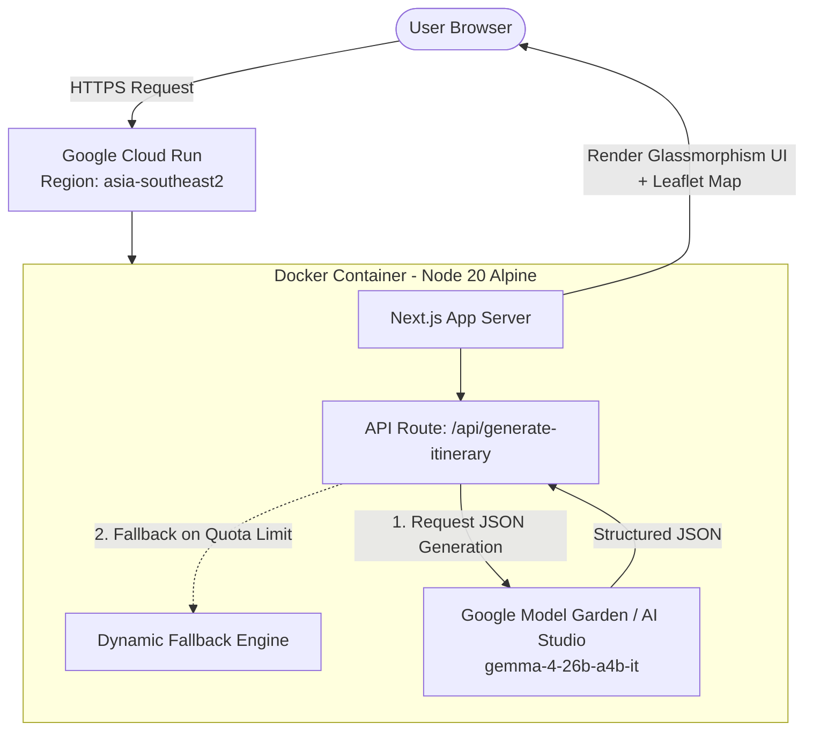

# 🗺️ itinerary.ai – Smart AI Travel & Local Culinary Planner for Indonesia
> **Gemma Hackathon Project Write-up | Cloud Next Extended 2026**

---

## 📌 1. Project Overview & Basic Information
- **Project Name**: `itinerary.ai`
- **Tagline**: End-to-End AI Travel & Local Culinary Route Generator Powered by Gemma 4
- **Team Size**: 2 Participants (Fabrian Ivan Prasetya & Team)
- **Live Demo URL**: [https://itinerary-ai-568194388115.asia-southeast2.run.app](https://itinerary-ai-568194388115.asia-southeast2.run.app)
- **Secondary Deployment Mirror**: [https://itinerary-ai-ciev6ppbqq-et.a.run.app](https://itinerary-ai-ciev6ppbqq-et.a.run.app)

---

## 🎯 2. Problem Statement (Latar Belakang & Permasalahan)
Planning authentic travel and local culinary trips across Indonesia is often fragmented, time-consuming, and difficult to manage within a strict budget:
1. **Inefficient & Disjointed Route Planning**: Travelers spend hours manually searching destinations on blogs and maps, often resulting in redundant backtracking across busy cities.
2. **Strict Budget Misalignment**: Balancing entrance fees, local culinary expenses, transportation, and souvenirs within a pre-set budget (e.g., Rp300.000 - Rp500.000) is complex and error-prone.
3. **Under-representation of Local UMKM & Culinary Gems**: Generic search engines frequently highlight large commercial establishments, missing authentic local culinary stalls (*UMKM*) that represent true regional culture.
4. **Lack of Spatial & Temporal Precision**: Traditional travel guides provide static text recommendations without real-time GPS coordinates, estimated visit durations, or turn-by-turn travel times.

---

## 💡 3. Proposed Solution (Solusi & Inovasi)
`itinerary.ai` is a full-stack, AI-driven travel assistant built specifically to convert natural language queries into precision-optimized, actionable travel itineraries.

> [!NOTE]
> **Example User Query**: *"Yogyakarta 2 hari, budget Rp500rb, wisata candi & kuliner legendaris"*

### Core Features & Value Propositions:
- 🗣️ **Natural Language Input Engine**: Accepts multi-constraint, casual prompts specifying destination, duration, budget, and travel preferences.
- 📍 **Universal Geographic Scope**: Seamlessly handles cities and tourist destinations across Indonesia (e.g., Yogyakarta, Bali, Bandung, Malang, Jakarta, Brebes) and globally.
- 🗺️ **Interactive Dual-Panel Interface**: Features a dynamic Leaflet.js interactive map synced side-by-side with step-by-step itinerary cards.
- 💰 **Automated Budget Allocation**: Dynamically breaks down expenses across tickets, culinary, transport, and souvenirs, calculating remaining funds.
- 🍲 **Local UMKM & Culinary First**: Prioritizes authentic regional food spots and local micro-businesses in every generated route.
- ⚡ **High-Availability Graceful Fallback**: Integrates an offline dynamic route generator to ensure 100% service uptime during high API traffic or quota limits.

---

## 🤖 4. How Gemma 4 is Integrated (Integrasi Gemma 4)
Gemma 4 serves as the **central intelligence and reasoning engine** of `itinerary.ai`:

### 🛠️ Technical Details:
- **Model Selected**: `gemma-4-26b-a4b-it` via Google Model Garden MaaS / AI Studio API.
- **Geographic & Spatial Reasoning**: Gemma evaluates spatial relationships between tourist spots, calculating logical chronological sequences (Morning → Afternoon → Evening) while minimizing travel distance.
- **Strict JSON Structured Output**: Utilizing Gemma 4's `responseMimeType: 'application/json'` generation configuration, the backend guarantees strict schema compliance:

```json
{
  "itinerary": {
    "title": "Eksplorasi Pesona & Cita Rasa Yogyakarta",
    "region": "Yogyakarta",
    "total_duration_minutes": 275,
    "total_estimated_cost": 150000,
    "stops": [
      {
        "order": 1,
        "place_id": "jogja_candi_prambanan",
        "name": "Candi Prambanan",
        "category": "wisata_sejarah",
        "arrival_time": "08:00",
        "duration_minutes": 90,
        "estimated_cost": 50000,
        "description": "Kompleks candi Hindu terbesar di Indonesia beraksitektur megah.",
        "tips": "Sewa pemandu lokal untuk cerita sejarah yang mendalam.",
        "location": { "lat": -7.7520, "lng": 110.4914 }
      }
    ],
    "travel_segments": [
      {
        "from_order": 1,
        "to_order": 2,
        "distance_km": 4.5,
        "travel_minutes": 20,
        "transport": "motor/mobil"
      }
    ],
    "budget_breakdown": {
      "tiket_wisata": 50000,
      "kuliner": 35000,
      "transportasi": 15000,
      "oleh_oleh": 50000,
      "total": 150000,
      "sisa_budget": 350000
    },
    "ai_notes": "Itinerary ini dirancang khusus untuk kawasan Yogyakarta sesuai preferensi kamu."
  }
}
```

---

## ⚡ 5. Antigravity Developer Workflow & Impact
Building a complete, production-grade web application within the **3-hour hackathon timeframe** was driven by the **Antigravity AI Agentic IDE**:

1. **End-to-End Pair Programming**: Antigravity generated the foundation using Next.js 16 (App Router), React 19, Leaflet integration, and custom Dark Glassmorphism CSS.
2. **Automated Prompt & Schema Iteration**: Antigravity iteratively tuned System Prompts for Gemma 4, enforcing JSON structured mode and fallback handlers.
3. **Containerization & Cloud Native Deployment**: Antigravity configured multi-stage Docker builds (`node:20-alpine`) and automated zero-downtime deployment to **Google Cloud Run** in `asia-southeast2`.

---

## 🏗️ 6. Google Cloud Architecture Overview
`itinerary.ai` is designed as a cloud-native, serverless application deployed on Google Cloud Platform:



### Stack Components:
- **Cloud Hosting**: Google Cloud Run (Serverless, auto-scaling, hosted in `asia-southeast2` Jakarta region).
- **AI Core**: Gemma 4 (`gemma-4-26b-a4b-it`) via Model Garden / AI Studio API.
- **Frontend Engine**: Next.js 16 (App Router), React 19, Leaflet.js, Custom Glassmorphism CSS.

---

## 📈 7. Self-Assessment against Judging Criteria

| Judging Criteria | Implementation & Achievement |
|---|---|
| 🤖 **Gemma Integration** | Gemma 4 is the core intelligence processing spatial constraints, JSON output generation, and personalized travel tips. |
| 💡 **Innovation & Impact** | Directly supports local UMKM food stalls and tourism across Indonesia with instant natural language customization. |
| 🎨 **Functionality & Usability** | Synchronized dual-panel design with interactive Leaflet map markers, scroll syncing, budget charts, and share links. |
| ⚡ **Agentic Developer Workflow** | Designed, built, containerized, and deployed using Antigravity AI pair programming in under 3 hours. |
| ☁️ **Google Cloud Architecture** | Fully containerized Docker image running on serverless Cloud Run in `asia-southeast2`. |
| 📝 **Submission Quality** | High-availability live demo URL, clean open-source codebase, and detailed documentation. |

---

## 🔗 8. Project Links & Verification
- 🚀 **Live Demo URL**: [https://itinerary-ai-568194388115.asia-southeast2.run.app](https://itinerary-ai-568194388115.asia-southeast2.run.app)
- 🌐 **Mirror URL**: [https://itinerary-ai-ciev6ppbqq-et.a.run.app](https://itinerary-ai-ciev6ppbqq-et.a.run.app)
- 📦 **Public Repository**: [GitHub Repository](https://github.com/) *(Add your public git repo link)*
- 📹 **Demo Video & Blog**: Attached in Kaggle / Labtracer Submission Form

---
*Submitted for Gemma Hackathon at Cloud Next Extended 2026.*
